# Innvotex - Corporate Web Application 🏭

### 🔴 LIVE STATUS: **ONLINE**
<a href="https://www.innvotex.com" target="_blank">
  
  <strong>CLICK HERE TO VISIT: www.innvotex.com</strong>
</a>
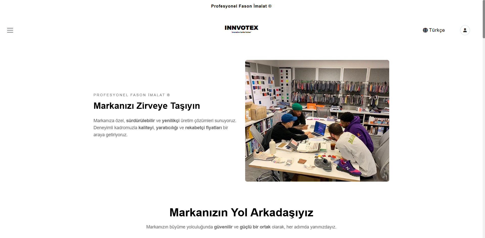

## 🚀 Project Overview

This project is a dynamic, secure, and fully responsive corporate website built for **Innvotex**, a textile machinery and consulting company.

Unlike static websites, this application features a **custom-built Content Management System (CMS)**, allowing the business owner to manage blogs, media galleries, FAQs, and incoming messages without touching a single line of code.

## 🛠️ Tech Stack

* **Backend:** Python 3, Flask Framework
* **Database:** SQLite (Lightweight & Fast)
* **Server:** GoDaddy Shared Hosting (cPanel) running via **Phusion Passenger**
* **Frontend:** HTML5, CSS3, Jinja2 Templates, JavaScript
* **Email Service:** Brevo API integration (Custom JSON encoding)

## 💡 Key Features & Deployment Challenge

One of the biggest achievements of this project was **deploying a modern Python/Flask application on a legacy Shared Hosting infrastructure**.

* **Security:** Implemented CSRF protection, secure admin authentication, and automated HTTPS enforcement via `.htaccess`.
* **Localization:** Multi-language infrastructure (TR/EN/FR).
* **Performance:** Optimized media serving and database queries for shared resources.

---

## 📸 Project Gallery

Here is a visual tour of the application features.

### 1. Home Page & Production
*Modern, responsive landing page design.*

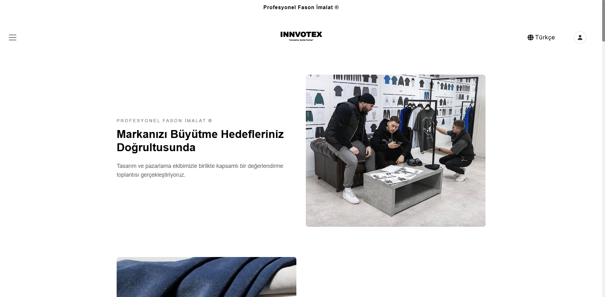

### 2. Secure Admin Dashboard & Login
*Protected administration panel for content management.*
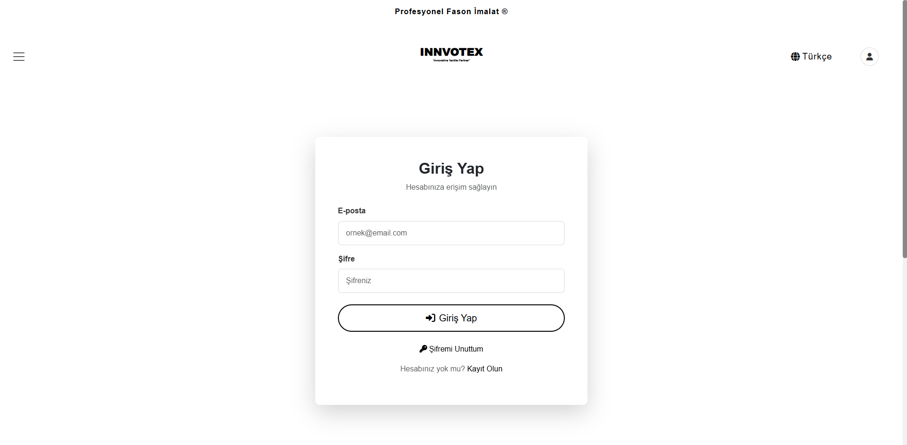
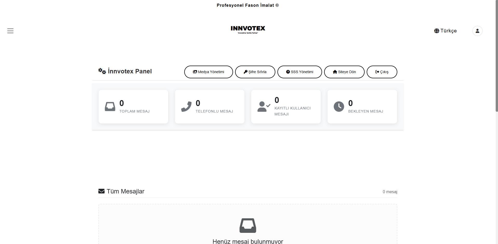

### 3. Dynamic Content Management
*Admins can easily manage Gallery images and FAQs (SSS) without coding.*
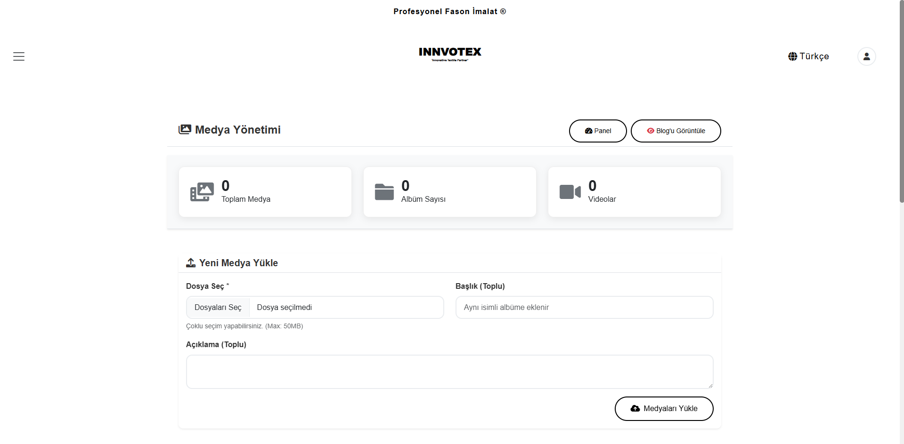
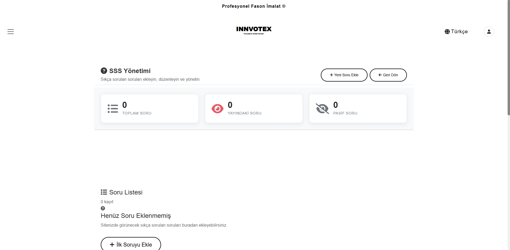

### 4. Multi-Language Support
*Seamless switching between English, French, and Turkish.*
| English View | French View |
|:---:|:---:|
|  | 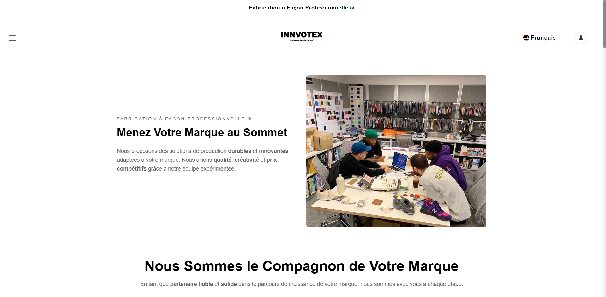 |

### 5. Mobile Responsiveness 📱
*Fully responsive layout optimized for all mobile devices.*

| Mobile Menu | Home View | Content | Forms | Details |
|:---:|:---:|:---:|:---:|:---:|
| 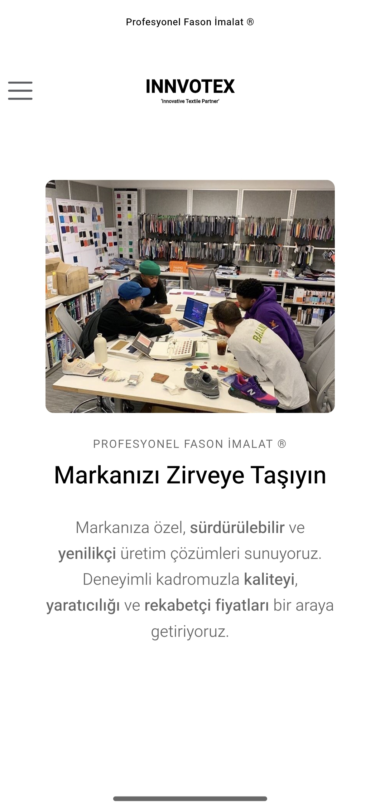 | 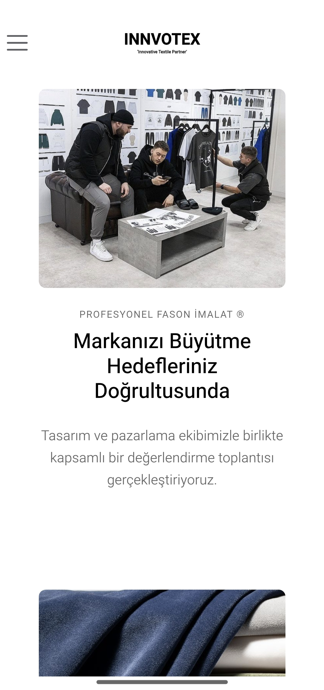 | 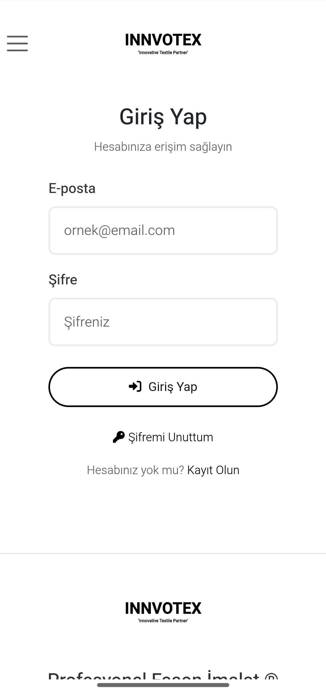 | 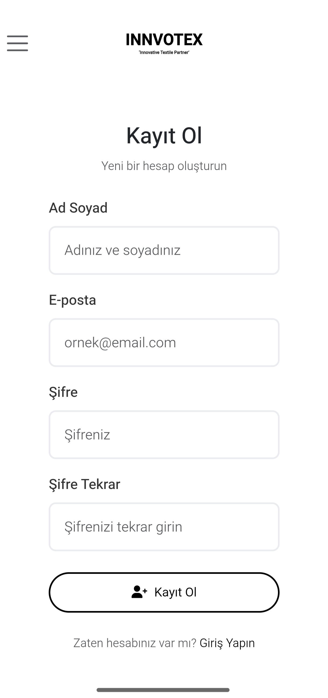 | 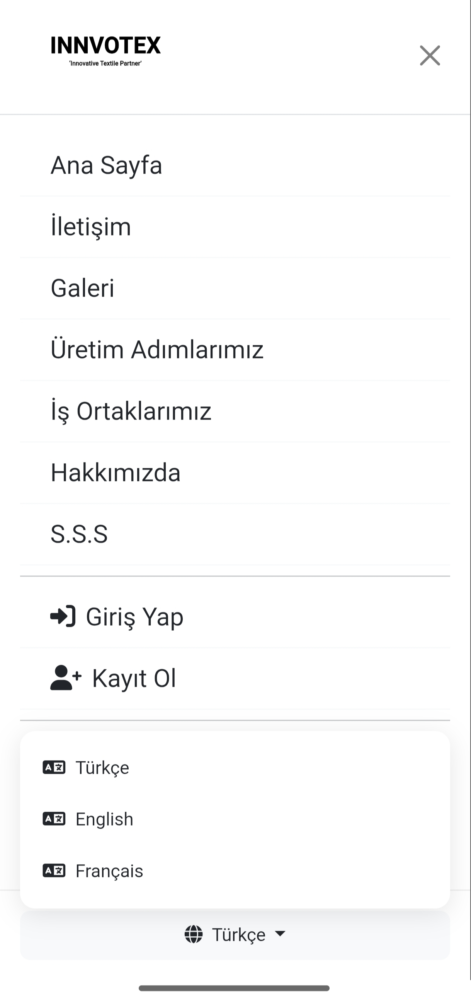 |

---

### 👨‍💻 Developer Notes

This repository serves as a showcase of my full-stack development and deployment skills. Due to client confidentiality, the full source code is not publicly available.

If you have questions about **deploying Flask on cPanel/Passenger**, feel free to reach out!
